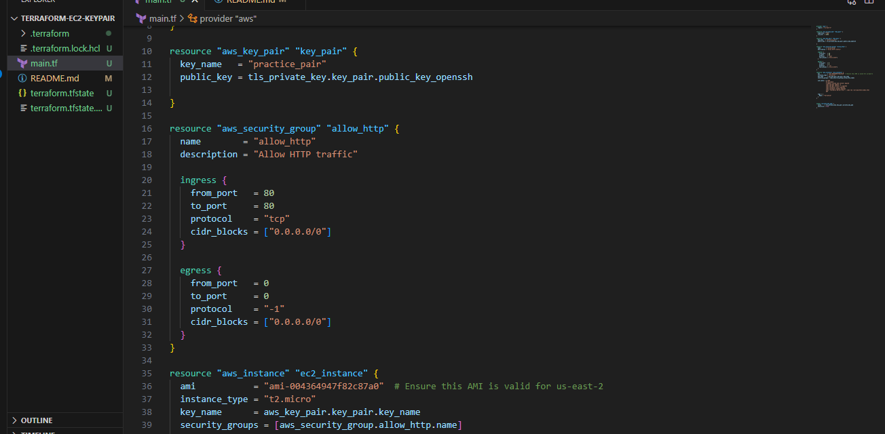
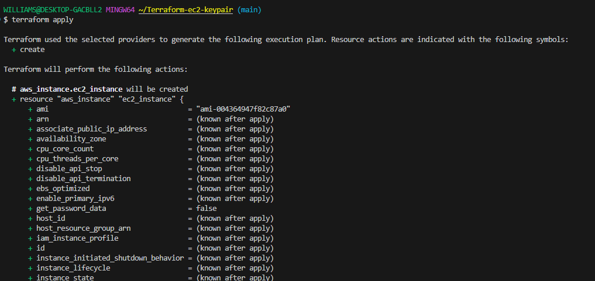
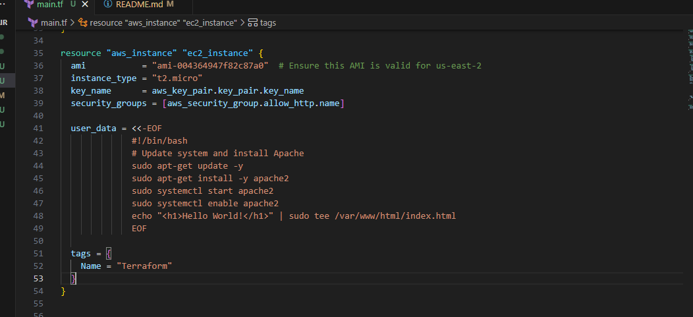
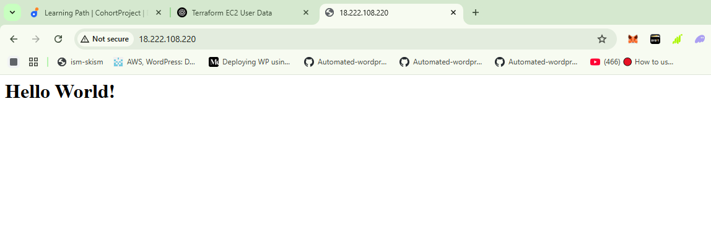

## Terraform EC2 Instance with Keypair and User Data

**Purpose:**

 In this mini project,i used terraform to automate launch of an EC2 instance on AWS. The project include generation of downloadable keypair for the instance and the execution of the user data script to install and configure Apacha http server.

 **Project Task:**

**Task 1: Terraform Configuration For EC2 instance**

1) Create a New directory for your terraform project

     ``mkdir Terraform-ec2-keypair``  

2) Cd into the New directory
3) Inside the New directory create a "Main.tf" file.
  
   ``touch main.tf``
4) Write a Terraform code to create an EC2 instance 
   

5) Initialize the Terraform project using the command 
   
   `` terraform init``
6) Apply the Terraform configuration to creratye the EC2 instance using the command

**Task:2 User Data Script execution:**

1) Terraform configuration including a user data provided

2) Apply the terraform configuration to launch the EC2instance with userdata script udsing the command
   
   ``terraform apply``

**Task3: Accessing the web Browser**
1) After the EC2 instance is created and runing access the apache web server on the browser by using the public ip address.
   ``<public ip address>``
2) Verify that the server display "Hello World" generated from the user data.
   .
